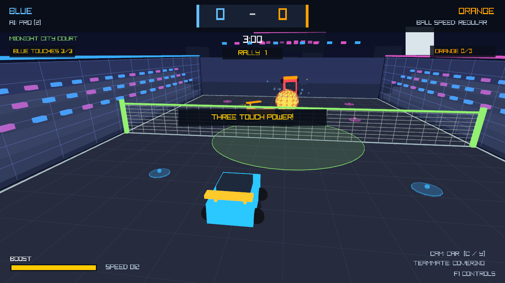
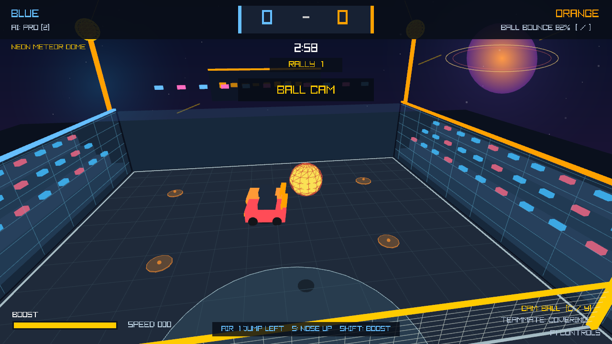
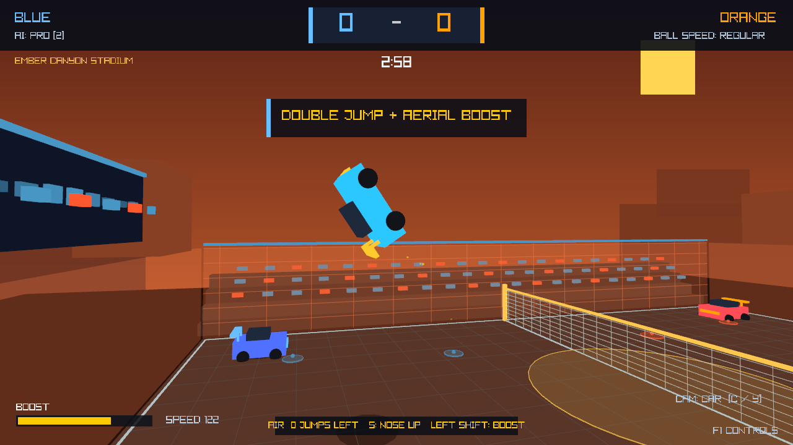

# Rocket Volley
Retro 3D car volleyball with 2v2, rotation-based 3v3, split-screen, a persistent Arcade Cup, a four-lesson Rocket Academy, and a cross-mode Pilot Record across forest, beach, city, and canyon arenas.
**[Download the latest Windows release](https://github.com/VrajP0518/RocketVolley/releases/latest)**, open **Assets**, and choose `RocketVolley-*-windows-x64.zip` (not “Source code”).
Extract the entire ZIP, keep its files together, and run `RocketVolley.exe` on Windows 10/11—there is no installer.
Controls: WASD drive, Space double-jumps, E dodges, Shift boosts, C changes camera, Q uses an optional Power Volley ability, and G toggles your saved personal-best Academy ghost; learn boost, jumps, aerial returns, and placement, chase the three-round Arcade Cup, complete ten Pilot Record milestones, or play true two-camera local split-screen with P2 on gamepad.
Reach supersonic speed and strike the front of an opponent to demolish them for three seconds. Cars that escape the arena automatically recover at a safe team spawn after five seconds.

The current source also includes contact-based scoring, coordinated AI, independent split-screen camera toggles (P1 C / P2 Y), Start to pause and A to skip replays. Alt-Tab or a disconnected controller pauses play; reconnect P2 before resuming co-op. F1 help pauses gameplay and blocks shortcuts behind the overlay. At 0:00, finish the rally; a tie starts overtime. In free training, R retries the same feed and subsequent feeds restart faster. See [the gameplay audit](docs/GAMEPLAY_AUDIT.md) for changes, tests, and remaining limitations.

Cars now share the same steering and contact rules, including AI opponents. Drive into the underside of the ball for lift; a moving bonnet/roof carries it in your direction of travel, while stationary catches retain their physical bounce. Serves start closer to the net. Bots prepare behind predicted contacts, keep defensive boost routes on their own half, and hand interceptions to upright teammates during recovery. Cameras rise above the cage near walls and account for the narrower split-screen view. Replays interpolate motion and preserve respawn visibility; hard landings have a short sound and dust cue.

## Practice and comfort options

Press **F11** or **Alt+Enter** for borderless fullscreen. You can also resize the window; the game and split-screen HUD scale together without stretching. **A steers left and D steers right** relative to the car, with matching aerial steering and directional dodges.

In team matches, the countdown identifies the first receiver. Your AI partner gives that player room, covers the next touch, and brakes when a teammate blocks its path. Receive duty rotates between points. Hard clears now lose some excess horizontal speed while keeping your shot direction and lift, making controlled returns easier without guaranteeing an in-bounds landing. Trees, stands and cage panels fade when they block the camera's view of your car or the ball, independently for each split-screen player.

In free training, press **L** to lock the current shot. Automatic retries repeat the same feed so you can practice a consistent approach. **Tab** changes feed type and **R** retries immediately. On gamepad, D-pad **Right** locks/unlocks, **Up** changes feed and **Down** retries. The HUD tracks completed returns, accuracy, current streak and best streak; abandoned retries do not count as completed shots. Custom driving bindings take priority over optional keyboard shortcuts.

Open **Audio / Comfort** from the main menu, or press **F2 / gamepad Y while paused**. Adjust music and sound effects independently, turn camera shake down to zero, or disable point replays for quicker matches. Settings apply immediately and save automatically. Returning from these options keeps the match paused. Existing profiles keep their original audio/visual defaults and records.

## Gameplay

### Local co-op and three-touch power

### Beach training arena

### Aerial play

